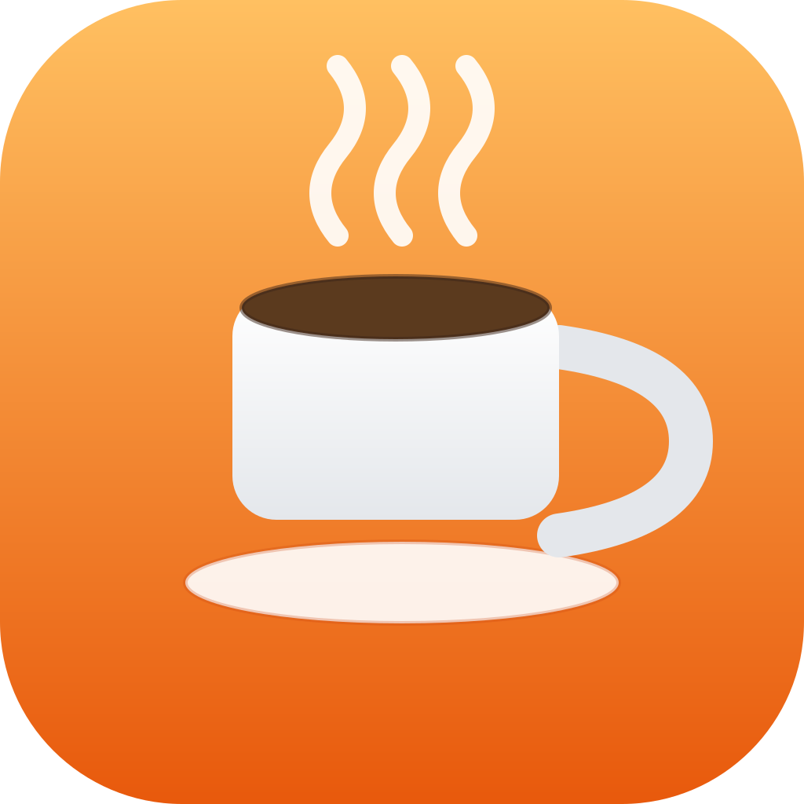

# MouseMover

A tiny native macOS **menu bar app** that keeps your Mac awake and your status
**active** (Teams, Slack, VPNs, etc.). Every interval it draws a quick, visible
circle with the cursor and injects a real mouse-move event, then puts the cursor
back where it was.

No Python, no Homebrew packages, no dependencies. Just Swift compiled locally
with the tools that ship with macOS.



## What it does

Two independent layers:

| Layer | Needs permission? | Effect |
| --- | --- | --- |
| Keep display awake + move the cursor (visible circle) | No | Screen never sleeps; you can see it working |
| Register as real user input | **Yes — Accessibility** | Teams/Slack/idle-trackers see you as *active* |

The visible movement uses `CGWarpMouseCursorPosition` (no permission). Getting
counted as "active" requires injecting a synthetic input event, which macOS only
allows if you grant the app **Accessibility** permission.

## Requirements

- macOS 12 or later
- Xcode **Command Line Tools** (for `swiftc`). If you don't have them:
  `xcode-select --install`

## Install

```bash
git clone https://github.com/Raulster24/mousemover.git
cd mousemover
./install.sh
```

`install.sh` builds the app, copies it to `/Applications`, sets it to launch at
login, and opens the Accessibility settings pane. Then:

1. **System Settings → Privacy & Security → Accessibility → turn ON "MouseMover"**
2. Reload it so the permission takes effect:
   ```bash
   launchctl kickstart -k gui/$(id -u)/local.rahul.mousemover
   ```

## Usage

Click the coffee-cup icon (☕︎) in the menu bar:

- **Start / Stop** (⌘S)
- **Move now (test)** (⌘M) — fire a circle immediately to confirm it works
- **Move every** — 15 / 30 / 60 / 120 / 300 seconds (default 60)
- **Quit** (⌘Q)

Default interval is 60s, which keeps Teams active (its away threshold is a few
minutes). If you set it very high (300s) it may briefly flip to away between
nudges.

## Uninstall

```bash
./uninstall.sh
```

Removes the app, the login item, and the Accessibility entry.

## Note on permissions (important)

This app is **ad-hoc signed** (no paid Apple Developer account). macOS ties the
Accessibility grant to the app's exact signature, so:

- You grant Accessibility **once per machine**.
- If you **rebuild / reinstall** (e.g. `git pull` + `./install.sh`), the
  signature changes and the grant resets — just turn the toggle on again.
  `install.sh` already resets the stale grant for you so the prompt is clean.

## How it verifies itself

macOS keeps two idle timers: a hardware one (IOKit) and a CoreGraphics event
timer (what Teams/Electron read). Warping the cursor only resets the hardware
timer; the injected event is what resets the CoreGraphics timer. If Teams still
shows you away, Accessibility isn't effective — re-grant it as above.

## License

MIT — do whatever you want.
